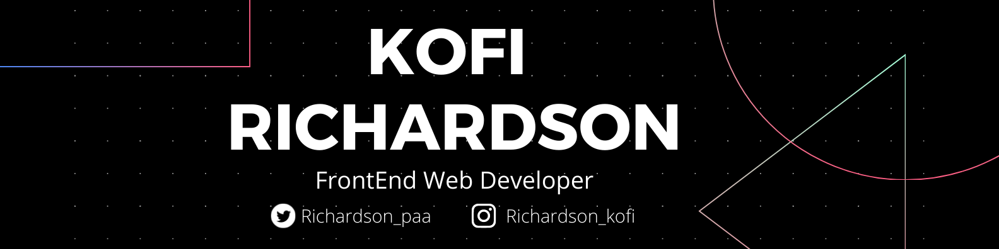

### 
I am Kofi Richardson a Front End web Developer since 2020

- 🔭 i am currently learning and getting stuff done (back-end Development)

 

## My Skill Set

<table><tr><td valign="top" width="33%">

### Frontend

  
  
  
  
  
  
  
  
  

</td><td valign="top" width="33%">

### Backend

  
  
  
  

</td><td valign="top" width="33%">

</td></tr></table>

 

## Connect with me

  

 

## Github Stats

 

## Recent Blog Posts

 

 

 

 

---

Generated using <a href="https://profilinator.rishav.dev/" target="_blank">Github Profilinator</a>

